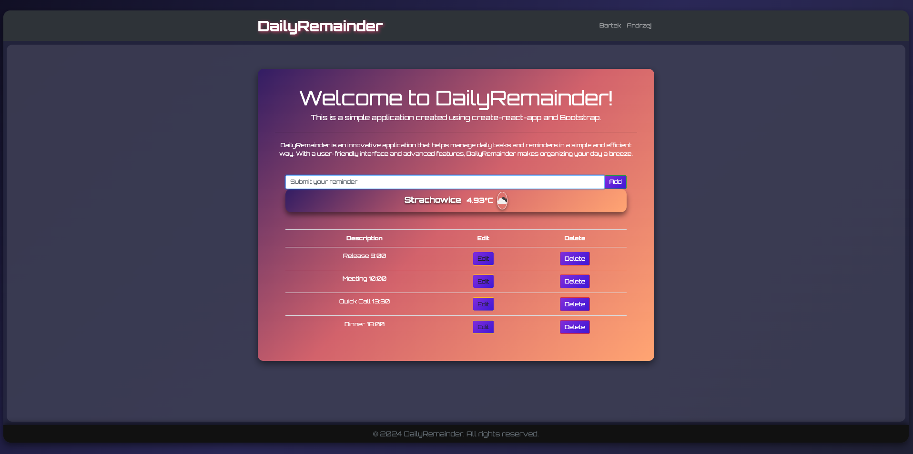
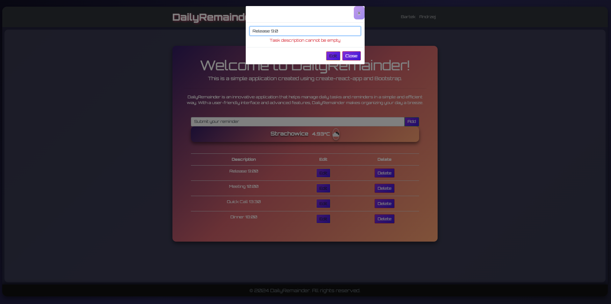

# DailyReminder
> A web-based application to set daily reminders for important tasks and activities.  

## Table of Contents
* [General Info](#general-information)
* [Technologies Used](#technologies-used)
* [Features](#features)
* [Screenshots](#screenshots)
* [Setup](#setup)
* [Project Status](#project-status)
* [Room for Improvement](#room-for-improvement)
* [Acknowledgements](#acknowledgements)
* [Contact](#contact)

## General Information
The **DailyReminder** application helps users to set and manage daily reminders for their tasks and activities. Users can:
- Create new reminders,
- View all reminders,
- Edit or delete existing reminders.

### Purpose:
The application aims to help users stay organized and ensure they do not forget important tasks and activities.

---

## Technologies Used
- **Frontend**:
  - React.js
  - Bootstrap CSS
- **Backend**:
  - Node.js
  - Postgres 16
- **Tools**:
  - Visual Studio Code

---

## Features
- ⏰ **Create Reminders**: Users can create new reminders with specific dates and times.
- 📋 **View Reminders**: Users can view all their reminders in a list format.
- ✏️ **Edit Reminders**: Users can edit existing reminders.
- ❌ **Delete Reminders**: Users can delete reminders they no longer need.

---

## Screenshots
 

### Reminder List


### Edit Reminder


---

## Setup

### Requirements:
- Node.js v16+
- Postgres 16+
- Browser (Safari/Chrome)

### Installation Steps:
1. Clone the repository:
   ```bash
   git clone [https://github.com/your-username/parking-management-system.git](https://github.com/peruzynski/DailyReminder.git)

2. Install dependencies for backend:
  ```bash
cd server
npm install
  ```
3.Install dependencies for frontend:

  ```bash
Skopiuj kod
cd client
npm install
  ```
4.Run backend:

```bash
cd server
node index.js

Expected output:
#server has started on port 5001
```
5.Run frontend:
```bash
cd client
npm start

Expected output:
# Compiled successfully!

# You can now view client in the browser.

#   Local:            http://localhost:3000
#   On Your Network:  http://192.168.100.29:3000

# Note that the development build is not optimized.
# To create a production build, use yarn build.

# webpack compiled successfully
```

## Project Status
Project is: in progress  
The main functionalities (creating, viewing, editing, and deleting reminders) are working. Future improvements and testing are ongoing.

## Room for Improvement
### Areas to improve:
- Add user authentication and authorization.
- Implement notifications for upcoming reminders.
- Improve UX/UI design with more intuitive interfaces.

### To-do:
- Add support for recurring reminders.
- Integrate calendar view for better reminder management.

## Acknowledgements
This project was inspired by the need for a simple and effective daily reminder application. Special thanks to:

- React.js and Node.js communities for the resources and support.
- Tailwind CSS for providing clean and responsive UI libraries.

## Contact
Created by [@peruzynski](https://github.com/peruzynski), [@andrzejtyszko](https://github.com/andrzejtyszko)
